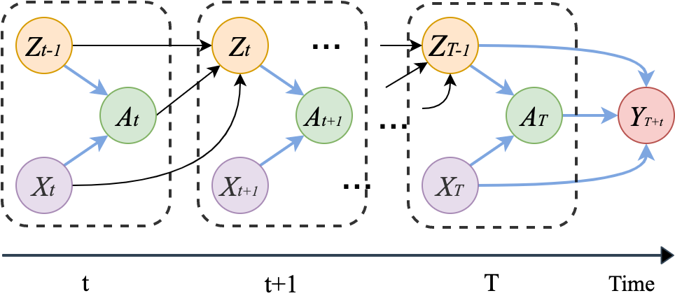
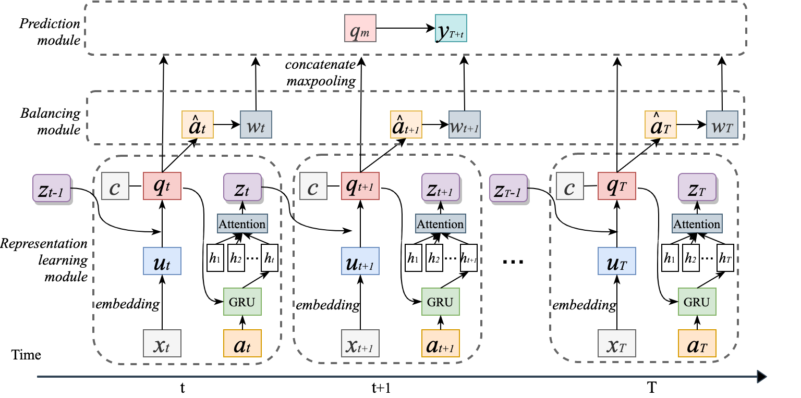

# DSW

# Introduction

This repository contains code for reproducing the paper ["Estimating Individual Treatment Effects with Time-Varying Confounders"]().

In this paper, we study the problem of Estimating individual treatment effects with time-varying confounders (as illustrated by a causal graph in the figure below)



The paper proposes Deep Sequential Weighting (DSW) for estimating ITE with time-varying confounders. DSW consists of three main components: representation learning module, balancing module and prediction module.



To demonstrate the effectiveness of the framework, the original paper conducts comprehensive experiments on synthetic, semi-synthetic and real-world EMR datasets ([MIMIC-III](https://mimic.physionet.org/)). DSW outperforms state-of-the-art baselines in terms of PEHE and ATE.

# Requirement

Ubuntu16.04, python 3.6

Install [pytorch 1.4](https://pytorch.org/)

# Data Generation

We need to generate data files using the MIMIC-iii data. These files will be used to generate the semi-synthetic and real world datasets.

## ICU Stay Ids

Use this [toolkit](https://github.com/alistairewj/sepsis3-mimic/tree/v1.0.0) to generate the `sepsis3-df.csv` by running the `sepsis-3-get-data.ipynb`. Move this file to the [./data](./data) folder. This file will then be used to generate both the `icustay_ids.txt` and `icu_hadm_dict.json` that will be used to generate the semi-synthetic and real world datasets used in `./simulation/pre_mimic.py` and `./simulation/simulate_mimic.py`

To generate the `icustay_ids.txt` and `icu_hadm_dict.json` files, run [data_generator.py](./data_generator.py) using `python data_generation.py`

## Time Varying Covariates

Follow the instructions [here](https://mimic.mit.edu/docs/gettingstarted/cloud/) to access MIMIC-iii data using [BigQuery](https://cloud.google.com/bigquery).

Once you have gained access to `mimiciii_derived` database in BigQuery, run the following SQL queries and save the resulting tables as csv files within the `./data` folder

```psql
-- save resulting table to pivoted_vitals.csv
SELECT icustay_id, charttime, HeartRate, SysBP, DiasBP, MeanBP, RespRate, TempC, Sp02
FROM `physionet-data.mimiciii_derived.pivoted_vital`;

-- save resulting table to pivoted_labs.csv
SELECT hadm_id, charttime, SODIUM, CHLORIDE, GLUCOSE, BUN, CREATININE, WBC, BANDS, HEMOGLOBIN, HEMATOCRIT, ANIONGAP, PLATELET, PTT, PT, INR, BICARBONATE, LACTATE
FROM `physionet-data.mimiciii_derived.pivoted_lab`;

-- save resulting table to pivoted_gcs.csv
SELECT icustay_id, charttime, GCS
FROM `physionet-data.mimiciii_derived.pivoted_gcs`
WHERE icustay_id IS NOT NULL;

-- save resulting table to urine_output.csv
SELECT icustay_id, charttime, value
FROM `physionet-data.mimiciii_derived.urine_output`
WHERE icustay_id IS NOT NULL;
```

Running [data_generator.py](./data_generator.py) will generate the `./data/x/{ID}.csv` files that will be used in [./simulation/pre_mimic.py](./simulation/pre_mimic.py) and [./simulation/simulate_mimic.py](./simulation/simulate_mimic.py).

## Static Demographic Data

Run the following SQL queries in BigQuery and save the resulting tables as .csv files in the [./data](./data/) folder.

```psql
-- save resulting table to detail.csv
SELECT hadm_id, admission_age, gender, ethnicity_grouped
FROM `physionet-data.mimiciii_derived.icustay_detail`
WHERE hadm_id IS NOT NULL;

-- save resulting table to comorbid.csv
SELECT hadm_id, metastatic_cancer, diabetes_complicated
FROM `physionet-data.mimiciii_derived.elixhauser_quan`
WHERE hadm_id IS NOT NULL;

-- save resulting table to height_weight.csv
SELECT icustay_id, height_first, weight_first
FROM `physionet-data.mimiciii_derived.heightweight`
WHERE icustay_id IS NOT NULL;
```

Running [data_generator.py](./data_generator.py) will generate the `./data/static/{ID}.static.npy` files that will be used in [./simulation/pre_mimic.py](./simulation/pre_mimic.py) and [./simulation/simulate_mimic.py](./simulation/simulate_mimic.py).

## Treatment Data

Run the following SQL queries in BigQuery and save the resulting tables as .csv files in the [./data](./data/) folder.

```psql
--save resulting table to vaso_durations.csv
SELECT icustay_id, vasonum, duration_hours
FROM `physionet-data.mimiciii_derived.vasopressordurations`
WHERE icustay_id IS NOT NULL;

-- save resulting table to vent_durations.csv
SELECT icustay_id, ventnum, duration_hours
FROM `physionet-data.mimiciii_derived.ventdurations`
WHERE icustay_id IS NOT NULL;

```

Running [data_generator.py](./data_generator.py) will generate the `./data/treatment/{treatment_option}/{ID}.npy` files that will be used in [./simulation/pre_mimic.py](./simulation/pre_mimic.py) and [./simulation/simulate_mimic.py](./simulation/simulate_mimic.py).

# Data preprocessing

### Synthetic dataset

Simulate the all covariates, treatments and outcomes

```
cd simulation
python synthetic.py
```

### Semi-synthetic dataset

With a similar simulation process, we construct a semi-synthetic dataset based on a real-world dataset: [MIMIC-III](https://mimic.physionet.org/).

```
cd simulation
python synthetic_mimic.py
```

### MIMIC-III dataset

Obtain the patients data of two treatment-outcome pairs: (1) vasopressor-Meanbp; (2) ventilator-SpO2.

```
cd simulation
python pre_mimic.py
```

# Full list of covariates

We show the full list of static demographics and time-varying covariates of sepsis patients obtained from [MIMIC-III](https://mimic.physionet.org/).
| Category | Items | Type |
|--------------|---------------------------------------------------------|--------|
| Demographics | age | Cont. |
| | gender | Binary |
| | race (white, black, hispanic, other) | Binary |
| | metastatic cancer | Binary |
| | diabetes | Binary |
| | height | Cont. |
| | weight | Cont. |
| | bmi | Cont. |
| Vital signs | heart rate, systolic, mean and diastolic blood pressure | Cont. |
| | Respiratory rate, SpO2 | Cont. |
| | Temperatures | Cont. |
| Lab tests | sodium, chloride, magnesium | Cont. |
| | glucose, BUN, creatinine, urineoutput, GCS | Cont. |
| | white blood cells count, bands, C-Reactive protein | Cont. |
| | hemoglobin, hematocrit, aniongap | Cont. |
| | platelets count, PTT, PT, INR | Cont. |
| | bicarbonate, lactate | Cont. |

We choose to not incorporate the variables Magnesium and C-Reactive Protein

# DSW

#### Running example

```
python train_synthetic.py --observation_window 30 --epochs 64 --batch-size 128 --lr 1e-3
```

#### Outputs

- ITE estimation metrics: PEHE, ATE
- Factual prediction metric: RMSE
